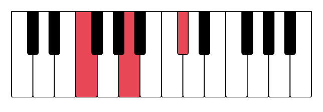
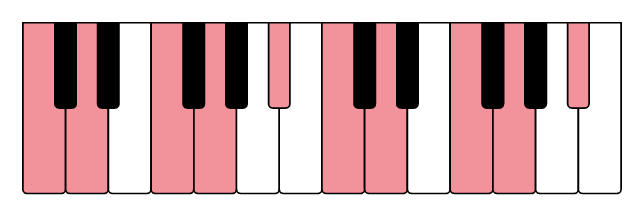
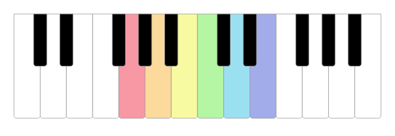
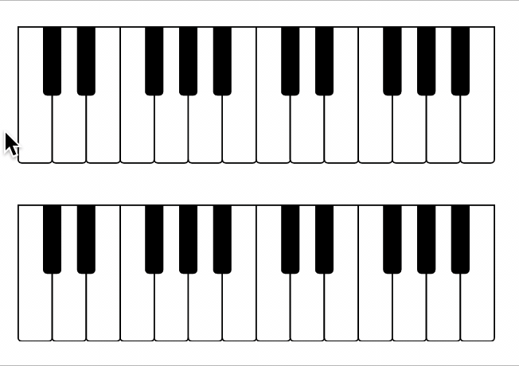

# Diatonic Piano

Interactive SVG piano as a React component.

## Reference

 * [Static Piano](#static-piano)
 * [Pressed and Highlighted keys](#pressed-and-highlighted-keys)
 * [Styling (CSS)](#css)
 * [Styling (prop themes)](#style-and-theme-props)
 * [Interactivity](#interactivity)
 * [Accessibility](#accessibility)

### Static Piano

By default, the piano will expand to fill its container. If you place the `<Piano>` tag inside a div with fixed width, you'll get a simple, static piano:

```jsx
<Piano />
```


The following props can be set to modify the static piano:

| Prop | Description | Default |
| ---- | ----------- | ------- |
| octaves | Number of octaves | `2` |
| width | Width of the \<svg\> element | `'100%'` |
| height | Height of the \<svg\> element | `'100%'` |
| preserveAspectRatio | Attribute for \<svg\> element [(details)](https://developer.mozilla.org/en-US/docs/Web/SVG/Attribute/preserveAspectRatio) | `'xMinYMin meet'` |

### Pressed and Highlighted keys

Two props can be used to set a key as _pressed_ or _highlighted_. There are no real differences between the two, but it can be used to separate permanently pressed keys from the key currently being hovered, or to mark a chord and a scale at the same time. The two props are:

| Prop | Description | Default |
| ---- | ----------- | ------- |
| pressed | Keys will be pressed | `[]` |
| highlighted | Keys will be highlighted | `[]` |

As an example, you can press _F4_, _A4_, and _C#5_ to highlight an F augmented chord:

```jsx
<Piano pressed={['F4', 'A4', 'C#5']} />
```



Internally, the component uses [kamasi](https://github.com/vegardege/kamasi) to figure out which notes to highlight. The component also accepts kamasi objects as input. So if your cool friends want to improvise over a D minor blues scale, you're just a single line from knowing which keys to use:

```jsx
import { scale } from 'kamasi'

<Piano highlighted={scale('D blues minor')} />
```



### Styling

There are two ways of styling a piano: CSS or the `style` and `theme` props. Both ways are illustrated below.

#### CSS

The SVG tags will be included in your DOM, and can be styled using normal CSS. The following classes are set in each piano:

| Class | Description |
| ----- | ----------- |
| .diatonic-piano | Top \<svg\> component |
| .diatonic-piano-octave-_\<n\>_ | The \<g\> tag grouping all keys within one octave |
| .diatonic-piano-key | The \<path\> tag for all keys in the piano |
| .diatonic-piano-key-_\<pitchclass\>_ | The \<path\> tag of all keys of this pitch class |
| .diatonic-piano-key-_\<pitch\>_ | The \<path\> tag of all keys of this pitch |

A pitch can be any letter from A–G. Sharps are replaced with _s_, e.g. C#4 woud be `.diatonic-piano-key-Cs4`.

Below is an example of how you could use CSS to style a piano:

```css
#rainbow .diatonic-piano-key { stroke: #999; stroke-width: 2 }
#rainbow .diatonic-piano-key-G4 { fill: #F898A4 }
#rainbow .diatonic-piano-key-A4 { fill: #FCDA9C }
#rainbow .diatonic-piano-key-B4 { fill: #F7FAA1 }
#rainbow .diatonic-piano-key-C5 { fill: #B4F6A4 }
#rainbow .diatonic-piano-key-D5 { fill: #9BE0F1 }
#rainbow .diatonic-piano-key-E5 { fill: #A2ACEB }
````

```js
<div id="rainbow">
   <Piano />
</div>
```



#### Style and Theme props

The component also accepts two props to style the piano:

| Prop | Description | Default |
| ---- | ----------- | ------- |
| theme | Default style of piano | `'default'` |
| style | Styles you want to overwrite | `{}` |

At the moment, only one theme is included, so you can ignore that prop until later versions.

`style` can be used to overwrite one or more style props. The `style` object will be merged with the theme, with `style` items taking precedence when present. The default theme looks like this:

```js
{
    diatonic: {
        fill: '#fff',
        pressed: '#E84855',
        highlighted: '#F2929A',

        stroke: '#000',
        strokeWidth: 4,

        height: 400,
        width: 100,
        rx: 10,
    },
    chromatic: {
        fill: '#000',
        pressed: '#E84855',
        highlighted: '#F2929A',

        stroke: '#000',
        strokeWidth: 4,

        height: 200,
        width: 50,
        rx: 10,
    },
}
```

You can overwrite any subset of these to modify the diatonic (white) or chromatic (black) keys.

So if you want to recreate the [stylophone](https://en.wikipedia.org/wiki/Stylophone), I won't stand in your way:

```jsx
<Piano style={{
    diatonic: {
        fill: '#ccc',
        rx: 0,
        height: 175,
        strokeWidth: 3,
    },
    chromatic: {
        fill: '#ccc',
        rx: 25,
        width: 100,
        height: 100,
        strokeWidth: 3,
    }
    }}
/>
```


#### Note about units

If you want to change any of the sizes, note that there is no absolute unit for the numbers. The \<svg\> element will automatically fill its container unless otherwise specified using the `width` or `height` prop.

The numbers only make sense in relation to each other. By default, the diatonic (white) keys are given a width of 100.

### Interactivity

Finally, you can add interactivity using the `onClick`, `onMouseEnter`, and `onMouseLeave` events.

| Prop | Description |
| ---- | ----------- |
| onClick | Called with note string when a key is pressed |
| onMouseEnter | Called with note string when the cursor enters a key |
| onMouseLeave | Called with note string when the cursor leaves a key |

The component does not have any internal state, and relies on the parent component to update the piano if you want to press or highlight keys. This gives the caller full control over how the piano can be used, and allow synchronization with other components.

Using [React hooks](https://reactjs.org/docs/hooks-intro.html), you only need a few lines of code to accomplish this. The following is the complete `App.js` file of two pianos, where the second mirrors the first, but transposed a perfect fifth.

```jsx
import { useState } from 'react'
import { Piano } from 'diatonic-piano'
import { NoteList } from 'kamasi'

function App() {
  const [pressed, setPressed] = useState(new NoteList())
  const [highlighted, setHighlighted] = useState(new NoteList())

  return <div style={{width: '300px'}}>
    <Piano pressed={pressed}
           highlighted={highlighted}
           onClick={n => setPressed(state => state.toggle(n))}
           onMouseEnter={n => setHighlighted(new NoteList([n]))}
           onMouseLeave={() => setHighlighted(new NoteList())} />
    <Piano pressed={pressed.transpose('P5')}
           highlighted={highlighted.transpose('P5')} />
  </div>
}

export default App;
```



See [kamasi's](https://github.com/vegardege/kamasi) documentation for more manipulation you can do, or check the Diatonic web site for inspiration.

### Accessibility

If you enable interactivity through use of the mouse, it's stronly encouraged that you also enable keyboard access for users who can't (or prefers not to) use a mouse or track pad. The component offers two compatible modes of keyboard access:


| Prop | Description | Default |
| ---- | ----------- | ------- |
| keyboardShortcuts | Enables keyboard control of piano keys | `false` |
| focusable | Enables browser keyboard navigation with \<tab\> and \<Enter\> | `false` |

The `keyboardShortcuts` prop makes the keyboard into a virtual piano. 'Q'–'M' is used for the third octave, 'A'-'J' for the fourth, and 'Z'–'M'for the fifth. 'Shift' will increase the pitch by a half tone, allowing you to play the black keys.

The `focusable` allows the user to traverse through the keys using \<tab\>, and click a key with \<Enter\>. This works for all visible keys on the piano.

Different browsers apply different styles to focused elements, but they tend not to work well with an \<SVG\> path element. As a result, it's encouraged to apply custom CSS.

Use `.diatonic-piano-key:focus` or `.diatonic-piano-key:focus-visible` to style the keys (e.g. set `fill` and `outline`). Note that the implementation of these vary between browsers.
